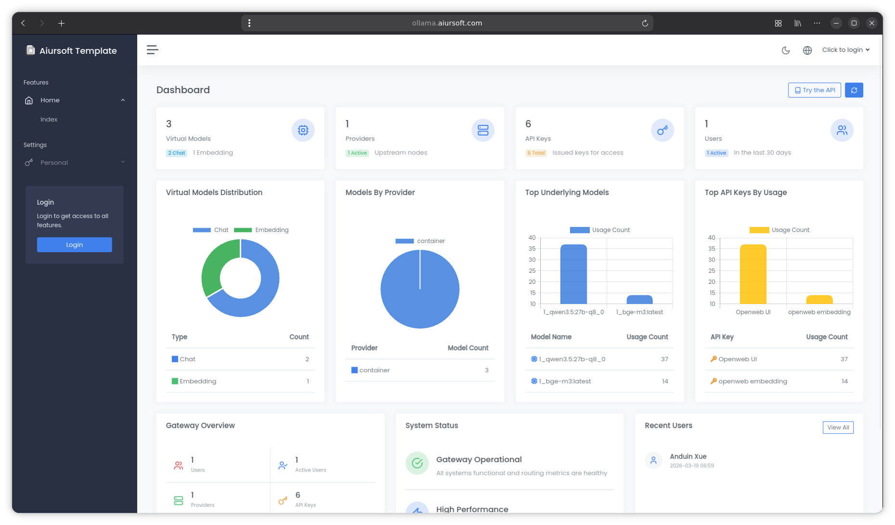

# Ollama Gateway

[](https://gitlab.aiursoft.com/aiursoft/ollamaGateway/-/blob/master/LICENSE)
[](https://gitlab.aiursoft.com/aiursoft/ollamaGateway/-/pipelines)
[](https://gitlab.aiursoft.com/aiursoft/ollamaGateway/-/pipelines)
[](https://manhours.aiursoft.com/r/gitlab.aiursoft.com/aiursoft/ollamaGateway.html)
[](https://ollama.aiursoft.com)
[](https://hub.docker.com/r/aiursoft/ollamagateway)

Ollama Gateway: Supercharge your native Ollama with enterprise-grade API authentication, request auditing, rate limiting, and virtual model management—your secure, private AI gateway.



Default user name is `admin@default.com` and default password is `admin123`.

## Try

Try a running OllamaGateway [here](https://ollama.aiursoft.com).

## Run in Ubuntu

The following script will install\update this app on your Ubuntu server. Supports Ubuntu 25.04.

On your Ubuntu server, run the following command:

```bash
curl -sL https://gitlab.aiursoft.com/aiursoft/ollamaGateway/-/raw/master/install.sh | sudo bash
```

Of course it is suggested that append a custom port number to the command:

```bash
curl -sL https://gitlab.aiursoft.com/aiursoft/ollamaGateway/-/raw/master/install.sh | sudo bash -s 8080
```

It will install the app as a systemd service, and start it automatically. Binary files will be located at `/opt/apps`. Service files will be located at `/etc/systemd/system`.

## Run manually

Requirements about how to run

1. Install [.NET 10 SDK](http://dot.net/) and [Node.js](https://nodejs.org/).
2. Execute `npm install` at `wwwroot` folder to install the dependencies.
3. Execute `dotnet run` to run the app.
4. Use your browser to view [http://localhost:5000](http://localhost:5000).

## Run in Microsoft Visual Studio

1. Open the `.sln` file in the project path.
2. Press `F5` to run the app.

## Run in Docker

First, install Docker [here](https://docs.docker.com/get-docker/).

Then run the following commands in a Linux shell:

```bash
image=aiursoft/ollamagateway
appName=ollamagateway
sudo docker pull $image
sudo docker run -d --name $appName --restart unless-stopped -p 5000:5000 -v /var/www/$appName:/data $image
```

That will start a web server at `http://localhost:5000` and you can test the app.

The docker image has the following context:

| Properties  | Value                           |
|-------------|---------------------------------|
| Image       | aiursoft/ollamagateway          |
| Ports       | 5000                            |
| Binary path | /app                            |
| Data path   | /data                           |
| Config path | /data/appsettings.json          |

## Parameter Behavior by Provider and API Format

Ollama Gateway supports two inbound API formats and two backend provider types, yielding four distinct request paths:

- **Paths ① and ③** enter via `/v1/chat/completions` and are handled by `OpenAIController`.
- **Paths ② and ④** enter via `/api/chat` and are handled by `ProxyController`.

> **"DB override"** means a hard assignment (`=`), not a null-coalescing assignment (`??=`). When the virtual model has a value configured in the database, the client-supplied value is **always discarded**, regardless of what the client sent.

| Parameter | ① OpenAI provider<br>+ OpenAI API | ② OpenAI provider<br>+ Ollama API | ③ Ollama provider<br>+ OpenAI API | ④ Ollama provider<br>+ Ollama API |
|-----------|-----------------------------------|-----------------------------------|-----------------------------------|-----------------------------------|
| Temperature | ✅ Client value arrives<br>DB hard-overrides if set<br>Forwarded as `"temperature"` (passthrough) | ✅ Client value arrives<br>DB hard-overrides if set<br>Forwarded as `"temperature"` | ✅ Client value arrives<br>DB hard-overrides if set<br>Forwarded as `options.temperature` to Ollama | ✅ Client value arrives<br>DB hard-overrides if set<br>Forwarded as `options.temperature` to Ollama |
| Top P | ✅ Client value arrives<br>DB hard-overrides if set<br>Forwarded as `"top_p"` (passthrough) | ✅ Client value arrives<br>DB hard-overrides if set<br>Forwarded as `"top_p"` | ✅ Client value arrives<br>DB hard-overrides if set<br>Forwarded as `options.top_p` to Ollama | ✅ Client value arrives<br>DB hard-overrides if set<br>Forwarded as `options.top_p` to Ollama |
| Top K | ❌ Always discarded<br>OpenAI does not support it<br>DB does not inject it | ❌ Always discarded<br>DB injects into `options` but the field is dropped before the OpenAI request is sent | ✅ Client cannot pass it (no such field in OpenAI API)<br>DB injects if set<br>Forwarded as `options.top_k` to Ollama | ✅ Client value arrives<br>DB hard-overrides if set<br>Forwarded as `options.top_k` to Ollama |
| Num Ctx | ❌ Always discarded<br>OpenAI does not support it<br>DB does not inject it | ❌ Always discarded<br>DB injects into `options` but the field is dropped before the OpenAI request is sent | ✅ Client cannot pass it (no such field in OpenAI API)<br>DB injects if set<br>Forwarded as `options.num_ctx` to Ollama | ✅ Client value arrives<br>DB hard-overrides if set<br>Forwarded as `options.num_ctx` to Ollama |
| Thinking | ❌ Always discarded<br>OpenAI does not support it<br>DB does not inject it | ❌ Always discarded<br>DB injects into `options` but the field is dropped before the OpenAI request is sent | ✅ Client cannot pass it (no such field in OpenAI API)<br>DB injects if set<br>Forwarded as `"think"` to Ollama | ✅ Client value arrives<br>DB hard-overrides if set<br>Forwarded as `"think"` to Ollama |

## How to contribute

There are many ways to contribute to the project: logging bugs, submitting pull requests, reporting issues, and creating suggestions.

Even if you with push rights on the repository, you should create a personal fork and create feature branches there when you need them. This keeps the main repository clean and your workflow cruft out of sight.

We're also interested in your feedback on the future of this project. You can submit a suggestion or feature request through the issue tracker. To make this process more effective, we're asking that these include more information to help define them more clearly.
